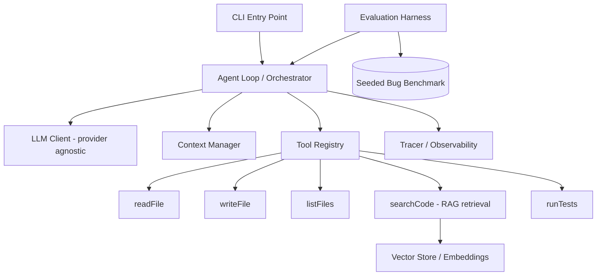

# PROJECT.md — Autonomous Java Bug-Fixing Agent

> A self-correcting AI agent that locates and fixes bugs in Java codebases by
> reasoning, editing code, running tests, and iterating until the tests pass.
> Built in Java with LangChain4j. The headline deliverable is a **measured
> resolution rate** on a self-built bug benchmark.

This document is the source of truth for the project. It is written to be read by
a coding agent (Claude Code) and a human reviewer. Work through the phases in
order. Each phase has concrete deliverables and acceptance criteria — do not
advance until the current phase's acceptance criteria pass.

---

## 1. Goals

**Primary goal.** Given a Java project containing a bug (with at least one failing
test that exposes it), the agent autonomously: locates the faulty code, edits it,
re-runs the test suite, reads the results, and iterates until tests pass or a
stop condition is reached.

**Why this design.** Success is *objectively verifiable* — the tests are green or
they are not. This makes it possible to build a real evaluation harness and report
a hard number (e.g., "resolves 68% of a 50-bug benchmark"). That metric is the
core resume signal.

**Resume skills this project must demonstrate** (these map directly to job
requirements — keep them in mind throughout):
- LLM application chains (the reason→act→observe agent loop)
- Model invocation with tool/function calling
- Vector libraries + knowledge base (agentic RAG over the codebase)
- Context management (summarizing/pruning tool output to fit the context window)
- Prompt optimization (measured, not vibes)
- Parameter optimization (temperature / max-tokens / model trade-offs, measured)
- Evaluation (a benchmark harness with a reported success rate)
- Observability (full trace of every step the agent takes)

## 2. Success Criteria (definition of done)

The project is "done" when ALL of the following are true:
1. The agent resolves at least one seeded bug end-to-end, fully autonomously.
2. An evaluation harness runs the agent across a benchmark of 30–50 seeded bugs
   and reports: resolution rate (%), mean steps per task, mean tokens per task.
3. Codebase retrieval uses a **vector store** (not "stuff the whole repo into the
   prompt").
4. Context management prevents context-window overflow on large tool outputs.
5. Every agent run produces a structured, inspectable trace.
6. The README reports a headline resolution-rate number and shows at least one
   before/after improvement from an optimization (prompt or parameter).

## 3. Tech Stack

- **Language:** Java 21
- **Build tool:** Maven (the agent must also invoke Maven/Gradle on *target*
  projects, so keep the runner abstracted — see `TestRunner`)
- **Agent framework:** LangChain4j 1.x
  - `dev.langchain4j:langchain4j` (core)
  - `langchain4j-agentic` (agentic patterns)
  - A provider module: `langchain4j-ollama` for local dev, plus
    `langchain4j-open-ai` (or another hosted provider) for final benchmark runs
  - `langchain4j-embeddings` + an in-memory embedding store for dev
  - `langchain4j-pgvector` for the persistent vector store (final version)
- **Embedding model:** a local embedding model via Ollama in dev (e.g., a
  general-purpose embedding model); keep it swappable.
- **Target-project test execution:** JUnit (the seeded bugs live in small Java
  projects with JUnit tests).
- **LLM provider strategy:** Make the chat model provider-agnostic. Develop
  against a local model (Ollama, free) to keep iteration costs at zero; run the
  final benchmark against a cheap hosted model. Never hard-code a provider.

> **Cost note for the human:** running the full benchmark repeatedly against a
> hosted API can get expensive. Develop locally; only spend tokens on final runs.

## 4. High-Level Architecture



**Control flow (one task):**
1. Harness resets the target repo to a known buggy state and starts a run.
2. Agent receives the task: project path + the failing test(s).
3. Loop: the agent reasons, calls a tool, observes the result, repeats.
4. The `searchCode` tool retrieves relevant files via vector similarity instead
   of dumping the whole repo into context.
5. The context manager summarizes/prunes long tool outputs (test logs, file
   contents) so the conversation stays within the model's window.
6. The agent edits code (`writeFile`), runs tests (`runTests`), and reads the
   outcome. If green → success. If still failing → iterate.
7. Stop conditions: tests pass, max iterations reached, or repeated no-progress.
8. The tracer records every step; the harness records pass/fail + metrics.

## 5. Proposed Repository Structure

```
java-bugfix-agent/
├── pom.xml
├── README.md
├── CLAUDE.md                    # short conventions file (see §9)
├── PROJECT.md                   # this document
├── src/main/java/com/example/agent/
│   ├── App.java                 # CLI entry point
│   ├── core/
│   │   ├── Agent.java           # the reason->act->observe loop
│   │   ├── AgentConfig.java     # model, temperature, max iterations, etc.
│   │   └── StopCondition.java
│   ├── llm/
│   │   └── ChatModelFactory.java # provider-agnostic model construction
│   ├── tools/
│   │   ├── FileTools.java        # readFile, writeFile, listFiles
│   │   ├── SearchCodeTool.java   # RAG retrieval over the codebase
│   │   └── TestRunnerTool.java   # runTests (shells out to Maven/Gradle)
│   ├── rag/
│   │   ├── CodeIndexer.java      # chunk + embed the target codebase
│   │   └── VectorStoreFactory.java # in-memory (dev) / pgvector (prod)
│   ├── context/
│   │   └── ContextManager.java   # summarize/prune long observations + memory
│   ├── observability/
│   │   └── Tracer.java           # structured per-step trace
│   └── exec/
│       └── TestRunner.java       # abstraction over Maven/Gradle invocation
├── src/test/java/...             # unit tests for the agent's own components
└── benchmark/
    ├── projects/                 # small Java projects used as fix targets
    ├── bugs/                     # seeded-bug definitions (see §6)
    └── runner/EvalHarness.java   # runs the agent over all bugs, reports metrics
```

## 6. Benchmark Design (the crown jewel — do not skip)

A "bug" in the benchmark is a known-good Java file with a single introduced
defect, plus a JUnit test that fails because of it.

Each benchmark entry should record:
- `id`: unique identifier
- `project`: which target project it belongs to
- `buggyFile` + `correctFile`: to apply and to reset
- `failingTest`: the test that exposes the bug
- `difficulty`: easy | medium | hard (off-by-one and null checks are easy;
  logic/algorithm bugs are hard)

**Harness responsibilities:**
- Reset the target project to its buggy state before each run (e.g., copy the
  buggy file in, or use git to reset).
- Run the agent with a hard iteration cap.
- Record: resolved (bool), iterations used, tokens used, wall-clock time.
- Output a summary: resolution rate overall and by difficulty, mean steps, mean
  tokens.

Aim for 30–50 bugs across 2–3 small target projects, spread across difficulties.

## 7. Key Component Contracts

Keep these interfaces small and testable.

- **`Agent.run(Task) -> RunResult`** — executes the full loop; returns whether it
  succeeded plus the trace and metrics. Must enforce the stop conditions.
- **Tools** — each tool is a method annotated as a LangChain4j `@Tool` with a
  clear description and typed parameters. Tool descriptions are part of prompt
  engineering: write them carefully.
  - `readFile(path)`, `writeFile(path, content)`, `listFiles(dir)`
  - `searchCode(query) -> top-k relevant code chunks` (vector retrieval)
  - `runTests() -> structured result {passed, failingTests, output}`
- **`ContextManager`** — given the running conversation + a new (possibly huge)
  observation, returns a context-safe version: truncate/summarize long test logs
  and file dumps, keep a rolling window of recent steps, retain the task goal.
- **`Tracer`** — append a structured record per step: the model's reasoning, the
  tool called, its arguments, and the observation (truncated). Persist to a file
  per run so runs are inspectable after the fact.
- **`ChatModelFactory`** — builds a LangChain4j chat model from config; switching
  provider/model/temperature is a config change, never a code change.

## 8. Guardrails & Failure Modes (handle these explicitly)

You WILL hit these. Treat them as first-class:
- **Editing the test instead of the code** — disallow writes to test files, or
  detect and reject them.
- **Infinite / no-progress loops** — cap iterations; detect repeated identical
  actions and stop.
- **Hallucinated file paths** — validate tool arguments before executing; return
  a clear error observation the agent can react to (don't crash the run).
- **Context overflow** — the `ContextManager` is the defense; verify on the
  largest test logs.
- **Malformed tool calls** — validate and return a corrective observation rather
  than failing the run.

## 9. Conventions & Commands

Put a short version of this section into `CLAUDE.md` so it's always in context.

- **Build:** `mvn clean install`
- **Run unit tests (the agent's own tests):** `mvn test`
- **Run the agent on one project:** `mvn exec:java -Dexec.mainClass=com.example.agent.App -Dexec.args="<projectPath>"`
- **Run the full benchmark:** a dedicated main in `benchmark/runner`.
- **Code style:** standard Java conventions; small classes, constructor
  injection, no static singletons for anything that needs swapping (models,
  vector stores). Favor interfaces at the seams (model, vector store, test
  runner) so they're mockable in tests.
- **Secrets:** API keys come from environment variables only — never commit them.
- **Every new component gets a unit test** before moving on.

## 10. Implementation Plan (full semester, ~14 weeks)

Work top to bottom. Each phase lists deliverables and acceptance criteria.

### Phase 1 — Foundations (Weeks 1–3)
**Deliverables:** Maven project; `ChatModelFactory` against Ollama; a single
working `@Tool` (e.g., `readFile`); the bare `Agent` loop (reason→act→observe)
with a max-iteration cap.
**Acceptance:** the agent can be asked a question, decide to call `readFile`,
receive the result, and produce a final answer. Loop terminates reliably.

### Phase 2 — Tool surface + RAG (Weeks 4–6)
**Deliverables:** `FileTools` (read/write/list); `TestRunnerTool` that shells out
to Maven and returns a structured result; `CodeIndexer` that chunks and embeds a
target codebase into an **in-memory vector store**; `SearchCodeTool` for semantic
retrieval. One easy seeded bug fixed end-to-end.
**Acceptance:** "it's alive" — given one easy bug, the agent searches, edits,
runs tests, and turns the suite green without human help.

### Phase 3 — Evaluation harness (Weeks 7–9)
**Deliverables:** 30–50 seeded bugs across 2–3 target projects; `EvalHarness`
that resets state, runs the agent per bug, and reports resolution rate (overall +
by difficulty), mean steps, mean tokens.
**Acceptance:** a single command runs the whole benchmark and prints a metrics
summary. You now have a baseline number.

### Phase 4 — Reliability, observability & context management (Weeks 10–12)
**Deliverables:** all guardrails from §8; `Tracer` writing a per-run structured
trace; `ContextManager` with summarization/pruning + a rolling memory window.
Then iterate on prompts, tool descriptions, and parameters to raise the score —
**recording before/after numbers each time.**
**Acceptance:** no run crashes on bad tool calls or huge logs; every run is
inspectable; you can show at least one measured improvement (e.g., adding a
self-critique step raised resolution from X% to Y%).

### Phase 5 — Polish & story (Weeks 13–14)
**Deliverables:** README with the headline metric, an architecture diagram, and
an ablation table (resolution rate as each feature was added); migrate the vector
store from in-memory to **pgvector** (Docker); a clean CLI demo.
**Acceptance:** a newcomer can read the README, understand the system, see the
numbers, and run a demo.

### Stretch (only if ahead of schedule)
Expose the agent's tools through an **MCP (Model Context Protocol) server** so the
toolset is reusable by other agents. Very current; rare in student projects.

## 11. Metrics to Capture (for the README and your resume)

Record these as you go — they become your resume bullets:
- Resolution rate overall and by difficulty
- Mean iterations and mean tokens per resolved bug
- Before/after deltas for each optimization (prompt change, parameter change,
  self-critique step, RAG vs. no-RAG)
- Provider/model comparison if you run more than one

Example bullets to fill in with real numbers:
- "Built an autonomous Java code-repair agent (LangChain4j) resolving X% of a
  50-bug benchmark via an iterative test-driven loop with tool calling and
  agentic RAG over a pgvector store."
- "Designed an evaluation harness measuring resolution rate, step count, and
  token cost; improved resolution X%→Y% through prompt and parameter
  optimization and a self-critique step."

## 12. Guidance for the Coding Agent

- Build incrementally and keep the project compiling and tested at every step.
- After each phase, run the acceptance check before moving on.
- Prefer small, testable units; mock the model and the test runner in unit tests
  so the agent's own logic is testable without spending tokens.
- Never hard-code a model provider, API key, or file path that should be config.
- When unsure about a design choice, prefer the simplest thing that satisfies the
  current phase's acceptance criteria; defer optimization to Phase 4.
