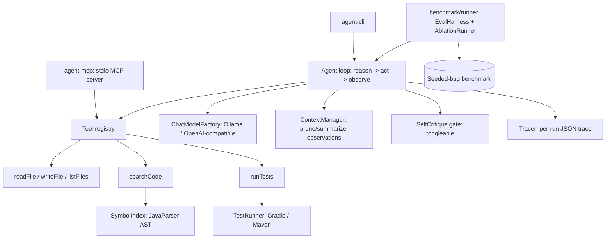

# java-bugfix-agent

> **English** | [中文](README.zh.md)

> An autonomous Java bug-fixing agent: given a project with a failing test, it
> locates the faulty code, edits it, re-runs the suite, and iterates until the
> tests pass or a stop condition is hit. Built in Java 21 with LangChain4j.

The headline deliverable is a **measured resolution rate** on a self-built bug
benchmark, graded by an independent test oracle — not by the agent's own claim.

## Headline numbers

Benchmark: 3 seeded-bug Gradle projects (`calc01`, `gcd03`, `str02`), each
verified RED→GREEN. Resolution is decided solely by the JUnit oracle. Ablation
against `gpt-4o-mini`, repeated K=3 per cell:

| Config | Resolve rate | Notes |
|---|---:|---|
| `BASE` (no retrieval) | 11–33% | only `str02`, and even that flickers run-to-run |
| `RAG` (AST retrieval) | **100%** (9/9) | all three cases, every run, ~6 iterations each |
| `CRITIC` | not measurable on free tier | see "Why the critic cells are open" |
| `RAG+CRITIC` | not measurable on free tier | see below |

**The load-bearing finding: RAG is what makes the agent work.** With AST-aware
retrieval off, the agent cannot reliably locate the faulty method and plateaus on
the one trivially-findable bug — and that result is itself noisy (33% on one full
run, 11% on another: `str02` is a coin-flip without retrieval). Turn retrieval on
and resolution jumps to a clean 100%, every case, every repeat, *and* the agent
finishes faster (≈6 vs. the 10-iteration cap). This holds with a strong hosted
model **and** a local 7B model — RAG is not a crutch for weak models, it is the
mechanism that turns "search the repo" into "find the symbol the failing test
exercises."

### Why the critic cells are open (and what that taught us)

The self-critique gate roughly **doubles** LLM-call volume per task. The hosted
runs go through a free OpenAI-compatible relay capped at **200 requests/day**. The
full 4-config K=3 matrix needs ~270+ calls, so the critic configs reliably hit the
daily cap mid-run and the remaining cells cascade into `stop=ERROR` (iter=0) — a
**quota exhaustion**, not a critic failure. We confirmed this directly: a probe
after the run returned the relay's own message, *"free account is limited to 200
requests per day."* Spacing calls out (a client-side throttle is built in, see
`AGENT_MIN_CALL_INTERVAL_MS`) does **not** help a per-day cap.

What the *valid* critic runs (the ones that completed before the cap) did show:
critic-only hits `MAX_ITERATIONS / UNRESOLVED` just like `BASE`. That is the
expected result, and it sharpens the headline — **the critic gates completion, it
does not help locate the bug; locating the bug is RAG's job.** The critic's
intended payoff is reducing *false positives* (agent declares COMPLETED but the
oracle disagrees, e.g. baseline `gcd03`); that mechanism is wired and unit-tested
(`docs/PHASE4-critic.md`), but a clean K=3 measurement needs an endpoint without a
daily request cap. See `docs/PHASE4-ablation.md`.

## Architecture



The reason→act→observe loop is the core. Each tool is a transport-agnostic plain
Java object with LangChain4j `@Tool` methods, so the exact same implementations
are served in-process to the CLI **and** over stdio by the MCP server.

### Retrieval is AST-aware, not dense vectors

`SymbolIndexer` (JavaParser) parses every `.java` file into per-symbol records
(FQN, kind, line range, signature, snippet) and reverse indexes
identifier→symbol and test→suspected-source. `searchCode` extracts identifier
tokens from a query and ranks by name-match quality, whether the symbol is
referenced by the failing test, and symbol kind. It returns **whole methods**, not
chopped text windows. The `Retriever` interface keeps a dense/BM25 implementation
as a future drop-in comparison row. Rationale is in [`PLAN.md` §5](PLAN.md) and
[`docs/PHASE2.md`](docs/PHASE2.md).

## Modules

| Module | Role |
|---|---|
| `agent-core` | agent loop, tools, AST retrieval, context mgmt, critic, tracer |
| `agent-cli` | CLI entry point |
| `agent-mcp` | Phase 5 stdio MCP server exposing the same `@Tool` objects |
| `benchmark/runner` | `EvalHarness` + `AblationRunner` over the seeded bugs |
| `benchmark/projects` | `calc01`, `gcd03`, `str02` target projects |

## What the MCP server exposes

`agent-mcp` is an MCP **server** — it is consumed by MCP clients (Claude Desktop,
Cline, other agents), it does not consume external tools. It runs **no LLM**; it
is a transport layer over the same `@Tool` objects the in-process agent uses:

| Tool | Capability |
|---|---|
| `readFile` / `writeFile` / `listFiles` | read/write/list files under the project root |
| `searchCode` | JavaParser AST symbol search — locate a class/method/field |
| `runTests` | run the suite (Gradle/Maven), return a structured PASS/FAIL report |

`writeFile` carries its guardrail into the protocol (writes under `src/test/` are
refused), and `runTests` is mounted only when a build tool is detected. The
differentiated capability here is `searchCode` — structural, Java-aware retrieval
that generic filesystem/grep MCP servers don't provide. See
[`docs/PHASE5-mcp.md`](docs/PHASE5-mcp.md).

## Quick start

Requires JDK 22 (compiles sources at `--release 21`) and, for local runs,
[Ollama](https://ollama.com) with an *instruct* model pulled
(`ollama pull qwen2.5:7b` — the `qwen2.5-coder` variant emits tool calls as text
and breaks the loop). Full setup in [`docs/RUN.md`](docs/RUN.md).

```bash
# Build + unit tests
./gradlew build

# Run the agent on a project (default: local Ollama qwen2.5:7b)
./gradlew :agent-cli:run --args="<projectPath> [<prompt>]"

# Run the benchmark / ablation matrix
./gradlew :benchmark:runner:runEval
AGENT_ABLATION_REPEATS=3 ./gradlew :benchmark:runner:runAblation

# Run the MCP server (stdio)
./gradlew :agent-mcp:run
```

To benchmark against a hosted model instead of local Ollama:

```bash
export AGENT_PROVIDER=openai
export OPENAI_API_KEY=sk-...
export AGENT_MODEL=gpt-4o-mini
export OPENAI_BASE_URL=https://api.openai.com   # or any OpenAI-compatible relay
```

### Configuration (env vars)

| Var | Default | Meaning |
|---|---|---|
| `AGENT_PROVIDER` | `ollama` | `ollama` \| `openai` |
| `AGENT_MODEL` | `qwen2.5:7b` | model name (use an *instruct* model for Ollama) |
| `AGENT_TEMPERATURE` | `0.2` | sampling temperature |
| `AGENT_MAX_ITERATIONS` | `10` | hard loop cap |
| `OLLAMA_BASE_URL` | `http://localhost:11434` | Ollama endpoint |
| `OPENAI_API_KEY` | — | required when provider is `openai` |
| `OPENAI_BASE_URL` | `api.openai.com` | any OpenAI-compatible endpoint |
| `AGENT_MIN_CALL_INTERVAL_MS` | `0` (off) | min gap between LLM calls; client-side throttle for **RPM**-limited endpoints (does not help per-day quotas) |
| `AGENT_ABLATION_REPEATS` | `1` | K runs per ablation cell (set 3+ for 7B noise) |

## Guardrails

The benchmark surfaces real failure modes, handled as first-class concerns:
writes to `**/src/test/**` are blocked (no editing the test to pass it),
iterations are hard-capped with no-progress detection, hallucinated paths return a
corrective observation instead of crashing the run, and `ContextManager` prunes
oversized test logs before they overflow the window. Every run writes an
inspectable JSON trace via `Tracer`.

## Project status

All five phases complete:

1. **Foundations** — Gradle multi-module, `ChatModelFactory`, agent loop, `readFile`.
2. **Tools + AST retrieval** — `FileTools`, `TestRunner` (Gradle/Maven), `SymbolIndexer`, `searchCode`; first green run.
3. **Benchmark** — `EvalHarness`, copy-to-temp isolation, independent oracle grading. [`docs/PHASE3.md`](docs/PHASE3.md)
4. **Reliability + ablation** — guardrails, `Tracer`, `ContextManager`, `SelfCritique`, the RAG×critic ablation matrix. [`docs/PHASE4-ablation.md`](docs/PHASE4-ablation.md)
5. **MCP server** — `agent-mcp` stdio server over LangChain4j community MCP. [`docs/PHASE5-mcp.md`](docs/PHASE5-mcp.md)

Source-of-truth docs: [`PROJECT.md`](PROJECT.md) (goals, success criteria),
[`PLAN.md`](PLAN.md) (deviations: Gradle over Maven, AST over dense vectors, full
ablation matrix, MCP promoted to core). A Chinese user guide is at
[`docs/USER_GUIDE.zh.md`](docs/USER_GUIDE.zh.md).

## Known limitations

- **3-case benchmark, not 30–50.** The harness and grading are built for scale;
  the headline number rests on 3 cases. More cases (not more repeats) is the next
  priority — `gcd03` is unsolved by the local 7B model and a good stress case.
- **Critic axis unmeasured at K=3** on the free relay: the critic doubles call
  volume and the full matrix exceeds the endpoint's 200-requests/day cap. Needs an
  endpoint without a daily quota (or a K=1 run that fits the budget).
- **Dense-vector `Retriever`** exists only as an interface seam; the "AST beats
  dense by N%" comparison row is unbuilt.
