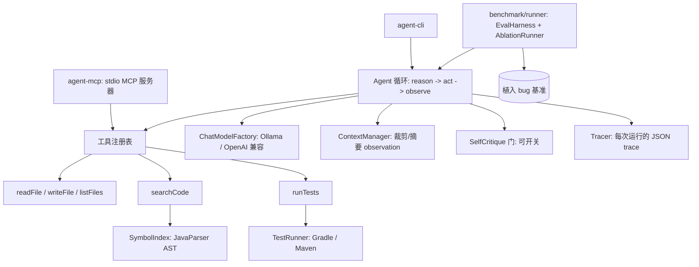

# java-bugfix-agent · 自主 Java Bug 修复 Agent

> [English](README.md) | **中文**

> 给定一个含 bug(至少一个失败测试暴露它)的 Java 项目,agent 自主地:定位故障代码、
> 编辑、重跑测试、读取结果,如此迭代直到测试转绿或触发停止条件。基于 Java 21 + LangChain4j。

核心交付物是一个在自建 bug 基准上**实测出来的修复率**——由独立的测试 oracle 判定,
**不是** agent 自说自话。

## 头条数字

基准:3 个植入 bug 的 Gradle 项目(`calc01`、`gcd03`、`str02`),每个都验证过
RED→GREEN。是否修复**只由 JUnit oracle 判定**。在 `gpt-4o-mini` 上做消融,每格重复 K=3:

| 配置 | 修复率 | 说明 |
|---|---:|---|
| `BASE`(无检索) | 11–33% | 只能修 `str02`,且这一个还会逐轮抖动 |
| `RAG`(AST 检索) | **100%**(9/9) | 三个 case 全中,每轮都中,约 6 次迭代收工 |
| `CRITIC` | 免费档测不了 | 见"为什么 critic 两格是空的" |
| `RAG+CRITIC` | 免费档测不了 | 见下 |

**最关键的发现:RAG 才是让 agent 跑起来的东西。** 关掉 AST 检索,agent 无法稳定定位
故障方法,只能停在那个"扫一遍就能撞到"的 bug 上——而且这个结果本身就是噪声(一整轮
33%、另一轮 11%:没有检索时 `str02` 就是抛硬币)。把检索打开,修复率跳到干净的 100%,
每个 case、每次重复都中,**而且**收工更快(约 6 次 vs. 10 次迭代上限)。这个结论在强力
托管模型**和**本地 7B 模型上都成立——RAG 不是给弱模型打的补丁,而是把"在仓库里搜"
变成"找到失败测试真正触及的那个符号"的机制。

### 为什么 critic 两格是空的(以及它教会我们什么)

自我批判门会让每个任务的 LLM 调用量大致**翻倍**。托管跑用的是一个免费的 OpenAI 兼容
中继,上限是**每天 200 次请求**。完整的 4 配置 × K=3 矩阵需要约 270+ 次调用,所以
critic 配置必然在跑到一半时撞上每日上限,余下的格子就级联成 `stop=ERROR`(iter=0)
——这是**额度耗尽**,不是 critic 失败。我们直接证实了:跑完后再探一次,中继自己回了
"免费账户每日限制 200 次请求"。把调用拉慢(内置了客户端节流,见
`AGENT_MIN_CALL_INTERVAL_MS`)对**每日**额度没有任何帮助。

额度耗尽前真正跑完的那些 critic 运行说明了什么:critic 单开和 `BASE` 一样撞
`MAX_ITERATIONS / UNRESOLVED`。这正是预期结果,而且它让头条更锋利——**critic 只管
"完工前审一道",不负责定位 bug;定位是 RAG 的活。** critic 真正的价值在于减少**假阳性**
(agent 宣布 COMPLETED 但 oracle 判没过,例如 baseline 的 `gcd03`);这套机制已接好并有
单测(`docs/PHASE4-critic.md`),但要拿到干净的 K=3 测量,需要一个没有每日请求上限的
端点。详见 `docs/PHASE4-ablation.md`。

## 架构



reason→act→observe 循环是核心。**一次迭代 = agent 做一个动作**(调一个工具,或宣布
完工),不是"一次解决"——修一个 bug 天然需要"列目录→读文件→改→跑测试→看结果→再改"
这样一串。每个工具都是 transport-agnostic 的普通 Java 对象、带 LangChain4j `@Tool`
注解,所以同一批实现既 in-process 供给 CLI,也通过 stdio 由 MCP 服务器对外暴露。

### 检索是 AST 感知,而非稠密向量

`SymbolIndexer`(JavaParser)把每个 `.java` 文件解析成按符号粒度的记录(FQN、种类、
行区间、签名、片段),并建反向索引:标识符→符号、测试→疑似源码。`searchCode` 从查询里
抽出标识符 token,按名字匹配质量、是否被失败测试引用、符号种类来排序。它返回**整个方法**,
而不是被切碎的文本窗口。`Retriever` 接口把未来的稠密/BM25 实现留作可插拔的对比行。
理由见 [`PLAN.md` §5](PLAN.md) 和 [`docs/PHASE2.md`](docs/PHASE2.md)。

## 模块

| 模块 | 职责 |
|---|---|
| `agent-core` | agent 循环、工具、AST 检索、上下文管理、critic、tracer |
| `agent-cli` | CLI 入口 |
| `agent-mcp` | Phase 5 stdio MCP 服务器,暴露同一批 `@Tool` 对象 |
| `benchmark/runner` | `EvalHarness` + `AblationRunner`,跑植入 bug 基准 |
| `benchmark/projects` | `calc01`、`gcd03`、`str02` 目标项目 |

## MCP 服务器对外暴露了什么

`agent-mcp` 是一个 MCP **服务器**——它被 MCP 客户端(Claude Desktop、Cline、其它 agent)
调用,自身**不**去调外部工具。它**不跑任何 LLM**;它只是同一批 `@Tool` 对象之上的传输层:

| 工具 | 能力 |
|---|---|
| `readFile` / `writeFile` / `listFiles` | 读/写/列项目根下的文件 |
| `searchCode` | JavaParser AST 符号检索——定位某个类/方法/字段 |
| `runTests` | 跑测试套件(Gradle/Maven),返回结构化的 PASS/FAIL 报告 |

`writeFile` 把它的护栏带进协议(拒绝写 `src/test/` 下的文件),`runTests` 仅在探测到
构建工具时才挂载。这里真正有差异化的能力是 `searchCode`——结构化、懂 Java 的检索,
通用的文件系统/grep 类 MCP 服务器给不了。详见 [`docs/PHASE5-mcp.md`](docs/PHASE5-mcp.md)。

## 快速上手

需要 JDK 22(以 `--release 21` 编译源码);本地跑还需要
[Ollama](https://ollama.com) 并拉一个 *instruct* 模型
(`ollama pull qwen2.5:7b`——`qwen2.5-coder` 变体会把 tool call 当成文本输出、
打断循环)。完整环境见 [`docs/RUN.md`](docs/RUN.md)。

```bash
# 构建 + 单测
./gradlew build

# 在某个项目上跑 agent(默认走本地 Ollama qwen2.5:7b)
./gradlew :agent-cli:run --args="<projectPath> [<prompt>]"

# 跑基准 / 消融矩阵
./gradlew :benchmark:runner:runEval
AGENT_ABLATION_REPEATS=3 ./gradlew :benchmark:runner:runAblation

# 跑 MCP 服务器(stdio)
./gradlew :agent-mcp:run
```

改用托管模型(而非本地 Ollama)跑基准:

```bash
export AGENT_PROVIDER=openai
export OPENAI_API_KEY=sk-...
export AGENT_MODEL=gpt-4o-mini
export OPENAI_BASE_URL=https://api.openai.com   # 或任意 OpenAI 兼容中继
```

### 配置(环境变量)

| 变量 | 默认 | 含义 |
|---|---|---|
| `AGENT_PROVIDER` | `ollama` | `ollama` \| `openai` |
| `AGENT_MODEL` | `qwen2.5:7b` | 模型名(Ollama 用 *instruct* 模型) |
| `AGENT_TEMPERATURE` | `0.2` | 采样温度 |
| `AGENT_MAX_ITERATIONS` | `10` | 循环硬上限 |
| `OLLAMA_BASE_URL` | `http://localhost:11434` | Ollama 端点 |
| `OPENAI_API_KEY` | — | provider 为 `openai` 时必填 |
| `OPENAI_BASE_URL` | `api.openai.com` | 任意 OpenAI 兼容端点 |
| `AGENT_MIN_CALL_INTERVAL_MS` | `0`(关) | LLM 调用间最小间隔;给 **RPM** 限流端点用的客户端节流(对每日额度无效) |
| `AGENT_ABLATION_REPEATS` | `1` | 每个消融格重复 K 次(7B 噪声大时设 3+) |

## 护栏

基准会暴露真实的失败模式,这里都当一等公民处理:禁止写 `**/src/test/**`
(不许改测试来骗过);迭代硬封顶 + 无进展检测;幻觉路径返回一条可纠正的 observation
而不是崩掉整轮;`ContextManager` 在超大测试日志撑爆窗口前先裁剪。每次运行都由 `Tracer`
写出一份可检视的 JSON trace。

## 项目状态

五个阶段全部完成:

1. **地基** —— Gradle 多模块、`ChatModelFactory`、agent 循环、`readFile`。
2. **工具 + AST 检索** —— `FileTools`、`TestRunner`(Gradle/Maven)、`SymbolIndexer`、`searchCode`;首次转绿。
3. **基准** —— `EvalHarness`、copy-to-temp 隔离、独立 oracle 评分。[`docs/PHASE3.md`](docs/PHASE3.md)
4. **可靠性 + 消融** —— 护栏、`Tracer`、`ContextManager`、`SelfCritique`、RAG×critic 消融矩阵。[`docs/PHASE4-ablation.md`](docs/PHASE4-ablation.md)
5. **MCP 服务器** —— `agent-mcp` stdio 服务器,基于 LangChain4j community MCP。[`docs/PHASE5-mcp.md`](docs/PHASE5-mcp.md)

权威文档:[`PROJECT.md`](PROJECT.md)(目标、成功标准)、[`PLAN.md`](PLAN.md)
(对 PROJECT.md 的偏离:Gradle 取代 Maven、AST 取代稠密向量、完整消融矩阵、MCP 升为核心)。
中文使用指南见 [`docs/USER_GUIDE.zh.md`](docs/USER_GUIDE.zh.md)。

## 已知局限

- **基准只有 3 个 case,不是 30–50。** harness 和评分是按规模设计的,但头条数字目前
  立在 3 个 case 上。下一步优先级是**加 case**(而非加重复次数)——`gcd03` 本地 7B
  还修不动,是个好的压力样本。
- **critic 轴在 K=3 下未测出**:critic 让调用量翻倍,完整矩阵超过端点的每天 200 次上限。
  需要一个没有每日额度的端点(或一次塞得进预算的 K=1 跑)。
- **稠密向量 `Retriever`** 目前只是个接口接缝;"AST 比稠密好 N%"那一行对比还没做。
